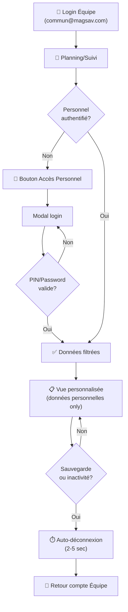

# 🔐 Authentification Personnelle — Résumé d'Implémentation

## ✅ Qu'est-ce qui a été créé

### Composants React
1. **PersonalAuthContext** — Contexte global pour gérer l'authentification personnelle
2. **PersonalLoginModal** — Modal pour saisir ID personnel + PIN/password
3. **usePersonalAuthWithAutoLogout** — Hook pour gérer auto-déconnexion
4. **PersonalSuiviWrapper** — Wrapper pour filtrer les fiches de suivi d'un personnel
5. **PersonalPlanningWrapper** — Wrapper pour filtrer le planning d'un personnel

### Documentation
- `GUIDE-AUTHENTIFICATION-PERSONNELLE.md` — Vue d'ensemble complète
- `INTEGRATION-AUTHENTIFICATION-PERSONNELLE.md` — Instructions pas à pas
- Ce fichier — Résumé et checklist

---

## 📋 Étapes d'intégration

### Étape 1 : Setup du Provider (5 min)
```jsx
// Dans apps/web/src/App.jsx
import { PersonalAuthProvider } from './contexts/PersonalAuthContext';

function App() {
  return (
    <AuthProvider>
      <PersonalAuthProvider>  {/* ← Ajouter ici */}
        <AppContent />
      </PersonalAuthProvider>
    </AuthProvider>
  );
}
```

### Étape 2 : Modifier PlanningPanel (10 min)

```jsx
// Dans apps/web/src/components/planning/PlanningPanel.jsx

import PersonalSuiviWrapper from '../suivi/PersonalSuiviWrapper';
import PersonalPlanningWrapper from './PersonalPlanningWrapper';

function PlanningPanel({ ... }) {
  const [personnel, setPersonnel] = useState([]);
  
  useEffect(() => {
    api.getSuiviPersonnel()
      .then(setPersonnel)
      .catch(() => setPersonnel([]));
  }, []);

  // Remplacer le rendu de ces deux onglets:
  return (
    <>
      {activeSubTab === 'suivi' && (
        <PersonalSuiviWrapper currentUser={currentUser} personnel={personnel} />
      )}
      
      {activeSubTab === 'tasks' && (
        <PersonalPlanningWrapper 
          currentUser={currentUser} 
          personnel={personnel} 
          googleEvents={googleEvents} 
        />
      )}
    </>
  );
}
```

### Étape 3 : Ajouter isPersonalMode à SuiviPanel (10 min)

```jsx
// Dans apps/web/src/components/suivi/SuiviPanel.jsx

function SuiviPanel({ 
  currentUser, 
  initialPersonId,
  isPersonalMode = false,      // ← Ajouter
  onPersonalDataSaved = null,  // ← Ajouter
}) {
  // Filtrer le personnel si isPersonalMode=true
  
  // Appeler onPersonalDataSaved après sauvegarde
}
```

### Étape 4 : Ajouter isPersonalMode à TaskPlanningPanel (10 min)

```jsx
// Dans apps/web/src/components/planning/TaskPlanningPanel.jsx

function TaskPlanningPanel({
  currentUser,
  personId = null,             // ← Ajouter
  isPersonalMode = false,      // ← Ajouter
  onPersonalDataSaved = null,  // ← Ajouter
  googleEvents = [],
}) {
  // Filtrer les tasks si isPersonalMode=true
  
  // Appeler onPersonalDataSaved après modification
}
```

### Étape 5 : Tester (15 min)

1. Login au compte commun@magsav.com (Équipe)
2. Aller au module Suivi ou Planning
3. Cliquer sur "🔐 Accès Personnel"
4. Sélectionner un personnel et entrer le PIN/password
5. Vérifier que seules les données de ce personnel s'affichent
6. Modifier une fiche → auto-déconnexion après 2s
7. Rester inactif 5+ min → auto-déconnexion

---

## 📁 Fichiers créés

```
apps/web/src/
├── contexts/
│   └── PersonalAuthContext.jsx          ✅ CRÉÉ
├── components/
│   ├── suivi/
│   │   ├── PersonalLoginModal.jsx       ✅ CRÉÉ
│   │   ├── PersonalLoginModal.css       ✅ CRÉÉ
│   │   ├── PersonalSuiviWrapper.jsx     ✅ CRÉÉ
│   │   └── SuiviPanel.jsx               ⬜ À MODIFIER
│   └── planning/
│       ├── PersonalPlanningWrapper.jsx  ✅ CRÉÉ
│       └── TaskPlanningPanel.jsx        ⬜ À MODIFIER
└── hooks/
    └── usePersonalAuthWithAutoLogout.js ✅ CRÉÉ

Documentation:
├── GUIDE-AUTHENTIFICATION-PERSONNELLE.md           ✅ CRÉÉ
└── INTEGRATION-AUTHENTIFICATION-PERSONNELLE.md     ✅ CRÉÉ
```

---

## 🔄 Flux utilisateur



---

## 🔒 Points de sécurité

✅ **Ce qui est fait :**
- Authentification via PIN/password (validé côté serveur)
- Route API existante : `/api/suivi/personal-auth`
- Context React pour gérer l'état global
- Auto-déconnexion après inactivité/modification
- Pas de nouveau token JWT (utilise token Équipe)

⚠️ **À vérifier :**
- [ ] Les routes API filtrent correctement par person_id
- [ ] Un personnel ne peut pas voir les données d'un autre
- [ ] Les permissions sont respectées côté serveur
- [ ] Les logs d'audit sont en place

---

## 📝 Checklist d'intégration finale

- [ ] PersonalAuthProvider dans App.jsx
- [ ] Imports des wrappers dans PlanningPanel
- [ ] PersonalSuiviWrapper utilisé à la place de SuiviPanel
- [ ] PersonalPlanningWrapper utilisé à la place de TaskPlanningPanel
- [ ] Liste du personnel chargée dans PlanningPanel
- [ ] SuiviPanel : props isPersonalMode et onPersonalDataSaved ajoutées
- [ ] TaskPlanningPanel : props isPersonalMode et onPersonalDataSaved ajoutées
- [ ] SuiviPanel : filtrage des données en isPersonalMode
- [ ] TaskPlanningPanel : filtrage des tâches en isPersonalMode
- [ ] SuiviPanel : callback onPersonalDataSaved appelé après sauvegarde
- [ ] TaskPlanningPanel : callback onPersonalDataSaved appelé après modification
- [ ] Tests fonctionnels validés
- [ ] Documentation partagée avec l'équipe

---

## 🚀 Prochaines améliorations (futures)

1. **Rappel d'auto-déconnexion** : Afficher un modal 1min avant la déconnexion
2. **Historique d'accès** : Logger les accès personnels avec timestamps
3. **Multi-dispositifs** : Gérer les accès depuis plusieurs appareils
4. **2FA optionnel** : Ajouter TOTP pour plus de sécurité
5. **Templates de tâches** : Pré-remplir les fiches avec tâches récurrentes

---

## ❓ Questions ?

Consulter :
- `GUIDE-AUTHENTIFICATION-PERSONNELLE.md` — Vue d'ensemble et architecture
- `INTEGRATION-AUTHENTIFICATION-PERSONNELLE.md` — Instructions détaillées
- Routes API : `/api/suivi/personal-auth` (déjà implémentée)

---

**Date de création** : 27 avril 2026  
**Statut** : ✅ Composants prêts, intégration en cours
